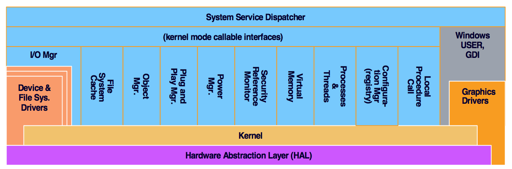

# Operating Systems Exercises

## Exercise 1

### 1.1

15 Punkte

#### Exercise

Beantworte folgende Fragen und erläutere die Antworten.

- Nennen und begründe vier Ziele beim Entwurf eines Betriebssystems!
- Nenne Beispiele für Betriebssystemfunktionalität die im Kernel- bzw. im Usermode implementiert werden müssen!
- Was sind Vor- und Nachteile der Trennung von Kernel- und Usermode?

#### Solution

**Ziele der User & Entwickler**

Schnell

- CPU Maximieren
- Scheduling
- User wollen nicht warten (Berechnung, IO)
- Produktivität erhöht sich, wenn das Betriebssystem schnell ist

Sicher

- Anwender möchten nicht, dass ihre Arbeit durch Fehler beeinträchtigt wird.
- Anwender möchten nicht warten bis System neu gestartet wird -> Zeitverlust
- Wollen sich nicht mit Fehlern beschäftigen müssen

Erweiterbar und leicht wartbar

- Betriebssystem Entwickler möchten dem Betriebssystem Funktionen hinzufügen, sobald neue Anforderungen entstehen.
- Man möchte nicht, dass ganze System ändern, wenn man eine Funktion ändert (Modularisiert)

Effizienz

- Das Betriebssystem soll Ressourcen effizient nutzen

* Mehrere Programme gleichzeitig ausführen
* Abstraktion
* Multi-User

**Betriebssystemfunktionalität im Kernel- & Usermode**

Kernel Mode: Ausgeführter Code hat vollständigen und uneingeschränkten Zugriff auf die Hardware des gesamten Systems.

* CPU, Speicher, I/O Verwaltung
* Multiprozessor Verwaltung, Test, Diagnose
* Teile des Dateisystems und des Netzwerks

User Mode:

* Compiler, Assembler, Interpreter, Linker/Loader
* Dateisystemverwaltung, Telekommunikation, Netzwerkverwaltung
* Editoren, Benutzer-Anwendungen

**Vorteile der Trennung**

* Sicherheitsvorteil
	- Crash im Kernelmode ist fatal
	- Usermode kein direkter Zugriff auf Hardware: Code im Usermode muss auf System APIs zugreifen
* Kernelmode erfordert strenge Anforderungen an Code => aufwendig und nicht flexibel, Treiber aber z.T. schneller (näher an Hardware)
* Usermode flexibler (Nachteil: Wechsel der Modi ist langsam)
  

### 1.2

10 Punkte

#### Exercise

Erkläre die Begriffe Programm, Prozess, Thread und Task! Worin bestehen die Unterschiede zwischen diesen Begriffen?

#### Solution

**Programm**
Folge von Anweisungen, geschrieben in einer Programmiersprache, welche eine bestimmte Funktion/ Aufgabe oder Problemstellung soll.
Ausführbare Programmdatei, die auf einem Datenträger liegt.
**Prozess**
Ist ein Programm in der Ausführung. Programmdatei wurde in Arbeitsspeicher geladen und ausgeführt.
  
Bezeichnet durch:

* Adressbereich
* Ressourcen
* Sicherheitsprofil
  
Ein Prozess besteht aus mindestens einem Thread.
**Thread**
Leichtgewichtiger Prozess, Ausführungsstrang, Teil eines Prozesses
Grundlegende Einheit in der CPU Nutzung
  
Besteht aus:

* ID
* Program Counter
* Register Set
* Stack
  
Teilt Informationen mit anderen Threads, die zu dem Prozess gehören. (Code/Data Section, BS Ressourcen)
**Task**
Unscharf formuliert. Manchmal auch als Oberbegriff von Prozess und Thread zu verstehen
Damals: Aufgabe aus Sicht des BS. (Thread)
In Softwarearchitektur: zusammenhängende Aufgaben (Prozess)
Linux unterscheidet nicht zwischen Prozess und Thread → benutzt den Begriff Task
Kontrollfluss innerhalb eines Programms.
**Unterschiede**

* Programm muss nicht in Ausführung sein
* Verwaltungsaufwand für Threads geringer als für Prozesse (Teilung von Ressourcen,...)
* Task ist die Linux Bezeichnung von Prozessen und Threads
**Wikipedia Beschreibung**
Ein [Prozess][0] bezeichnet den Ablauf eines [Computerprogrammes][1] auf einem oder mehreren [Prozessor][2](en). Einem Prozess sind ein Adressraum und weitere Betriebssystemmittel zugeordnet. Ein Prozess kann mehrere Threads oder - wenn bei dem Programmablauf keine Parallelverarbeitung vorgesehen ist - auch nur einen einzigen Thread beinhalten. Threads teilen sich innerhalb eines Prozesses Prozessoren, den Speicher und andere betriebssystemabhängige Ressourcen wie Dateien und Netzwerkverbindungen. Deswegen ist der Verwaltungsaufwand für Threads üblicherweise geringer als der für Prozesse. Ein wesentlicher Effizienzvorteil von Threads besteht darin, dass im Gegensatz zu Prozessen beim Threadwechsel kein vollständiger Wechsel des[Prozesskontextes][3] notwendig ist, da alle Threads einen gemeinsamen Teil des Prozesskontextes verwenden.
Bereits in den 1980er Jahren gab es sogenannte [Multitask-Betriebssysteme][4], da im Unterschied zu den joborientierten Systemen insbesondere in der damals so bezeichneten[Prozessrechentechnik][5] mehrere Aufgaben quasi parallel ausgeführt werden mussten. Damals hat sich der Begriff [Task][6] für eine Aufgabe aus Sicht des Betriebssystems eingebürgert, das ist synonym zu dem hier beschriebenen Thread. Der Begriff Task (deutsch: Aufgabe) wird in der Softwarearchitektur aber auch unscharf allgemein für zusammenhängende Aufgaben benutzt, und insbesondere auch synonym für Prozess eingesetzt.
Ein Thread ist wörtlich ein einzelner Ausführungsfaden eines Programms, der Begriff Thread wird aber auf den Ausführungsstrang aus Sicht des Betriebssystems eingesetzt (Kernelthread). In einer Anwendersoftware kann dieser Ausführungsstrang durch geeignete Programmierung nochmals in unabhängige Einzelstränge unterteilt werden. Im englischen Sprachraum hat sich für den einzelnen Ausführungsstrang der Anwendersoftware der Begriff [User Thread][7] (bei Microsoft Fiber, deutsch: Faser) eingebürgert. Bei User Threads ist allein die Anwendersoftware für die Verwaltung ihrer Ausführungsstränge zuständig.
  

### 1.3

35 Punkte

#### Exercise

Die folgenden Bilder zeigen den Aufbau des Windows- und des Linux-Kernels.

Mach dich mit der Dokumentation/Quellen des Windows Research Kernels (WRK) und des Linux-Kernels vertraut und beantworte die folgenden Fragen:

- Wie lässt sich in der Verzeichnisstruktur auf den Kernelaufbau abbilden?
- Welche Teile des Windows-Kernels sind nicht im WRK enthalten?
- In welchen Dateien werden Scheduling Entscheidungen getroffen?
- Lade die Quellen Linux (kernel.org) / WRK von https://maniac.hpi.uni-potsdam.de/ herunter.

Hinweis:
Die Dokumentation für den Windows Research Kernel ist innerhalb des HPI unter http://wrk.dcl.hpi.uni-potsdam.de/ erreichbar.
Der dokumentierte Linux Kernel ist z.B. unter http://lxr.linux.no/ zu finden.

#### Solution

**Wie lässt sich in der Verzeichnisstruktur auf den Kernelaufbau abbilden?**

Ordner verwalten Funktionalitäten zu einem bestimmten Modul des Betriebssystems. Die Module werden also durch Verzeichnisse geordnet. (Bsp. siehe unten)
Die Verzeichnisstruktur gibt keinen Überblick über die Hierarchie.
  
Directory of C:\Users\Name\Desktop\LinuxDoku\linux-2.6.32.46

	13.11.2013 18:17 <DIR\> arch (CPU Dependent Code)
	13.11.2013 18:17 <DIR\> block (block device drivers)
	13.11.2013 18:17 <DIR\> crypto
	13.11.2013 18:16 <DIR\> Documentation 
	13.11.2013 18:19 <DIR\> drivers(device drivers)
	13.11.2013 18:19 <DIR\> firmware(device dependent firmware files)
	13.11.2013 18:19 <DIR\> fs(file system)
	13.11.2013 18:34 <DIR\> include
	13.11.2013 18:34 <DIR\> init
	13.11.2013 18:34 <DIR\> ipc(inter-process communication)
	13.11.2013 18:34 <DIR\> kernel (processes, scheduling, power management, signals)

Directory of C:\Users\Name\Desktop\LinuxDoku\linux-2.6.32.46\kernel

	13.11.2013 18:34 <DIR\> gcov (gcc\_3.\_4 ist hier)
	13.11.2013 18:34 <DIR\> irq (Interrupts)
	13.11.2013 18:34 <DIR\> power (hibernate.c; poweroff.c; process.c; suspend.c)
	13.11.2013 18:34 <DIR\> time (clockevents.c)
	13.11.2013 18:34 <DIR\> trace
	13.11.2013 18:34 <DIR\> lib
	13.11.2013 18:34 <DIR\> mm (virtual memory managment)
	13.11.2013 18:35 <DIR\> net (network protocols)
	13.11.2013 18:35 <DIR\> samples
	13.11.2013 18:35 <DIR\> scripts
	13.11.2013 18:35 <DIR\> security
	13.11.2013 18:35 <DIR\> sound
	13.11.2013 18:35 <DIR\> tools
	13.11.2013 18:35 <DIR\> usr
	13.11.2013 18:35 <DIR\> virt
  
  
Directory of C:\Users\Basti\Desktop\WRKDoku\WRK-V1.2\BASE\NTOS

	16.11.2013 17:54 <DIR\> BUILD
	16.11.2013 17:54 <DIR\> CACHE
	16.11.2013 17:54 <DIR\> CONFIG registry
	16.11.2013 17:54 <DIR\> DBGK user-mode debugger service
	16.11.2013 17:54 <DIR\> EX HANDLE.c → handle management, POOL.c → pool allocator
	16.11.2013 17:54 <DIR\> FSRTL PnP.c
	16.11.2013 17:54 <DIR\> FSTUB
	16.11.2013 17:54 <DIR\> INC
	16.11.2013 17:54 <DIR\> INIT
	16.11.2013 17:54 <DIR\> IO I/O Mgr \\IOMGR (IOINIT.c, IOSUBS.c...)
	16.11.2013 17:54 <DIR\> KE Exception Handling, scheduler, CPU management
	16.11.2013 17:54 <DIR\> LPC Local Procedure Call (LPCINIT.c, LPCCONN.c, LPCLISTN.c)
	16.11.2013 17:54 <DIR\> MM Memory Management, Virtual Memory
	16.11.2013 17:54 <DIR\> OB Object Mgr. (OBCREATE.c, OBINIT.c, OBHANDLE.c)
	16.11.2013 17:54 <DIR\> PERF
	16.11.2013 17:54 <DIR\> PS Processes and Threads (CREATE.c)
	16.11.2013 17:54 <DIR\> RAW
	16.11.2013 17:54 <DIR\> RTL
	16.11.2013 17:54 <DIR\> SE Security Reference Monitor
	16.11.2013 17:54 <DIR\> VDM
	16.11.2013 17:54 <DIR\> VERIFIER
	16.11.2013 17:54 <DIR\> WMI

**Was ist nicht im WRK enthalten?**

- HAL
- Dateisysteme
- Treiber von Geräten
- Netzwerk-Stacks
  
**Wo sind Scheduling Informationen?**
Linux:
\linux-2.6.32.46\kernel\sched.c "Kernel scheduler and related sys calls"

Dateien:

- sched.c
- sched\_clock.c
- sched\_debug.c
- sched\_fair.c
- ...

Windows:
base/ntos/ke/

- thredsup.c (KiSelectNextThread)
- idsched.c (idle scheduling)

### 1.4

10 Punkte

#### Exercise

Mach dich mit der Betriebssystemgeschichte vertraut. Nenne jeweils drei Merkmale (APIs, Kommandosprachen-Konstrukte, Systemprogramme) die Windows und Linux aus Vorgängersystemen übernommen haben.

#### Solution

1. Time-sharing

2. Virtuelle Speicherverwaltung
	Jeder Prozess bekommt seinen eigenen virtuellen zusammenhängenden Speicherbereich. Dies wird dadurch bewerkstelligt, dass die virtuellen Speicheradressen auf den physikalischen Speicher gemapt werden. Ein Vorteil davon ist, dass Prozesse nun ihren eigenen zusammenhängenden Speicher haben, sie können nur auf diesen zugreifen. Dies erhöht die Sicherheit, da Prozesse nicht mehr versehentlich auf fremden Speicher zugreifen können. Zudem ist es mit virtueller Speicherverwaltung und Paging sogar möglich, mehr Speicher zu verwenden, als es physikalischen Speicher gibt. Dies wird durch swapping möglich gemacht. Beim swapping werden Teile des virtuellen Speichers auf die Festplatte ausgelagert. Virtueller Speicher wird seit Win95 verwendet (Linux unbekannt).

3. Kommandozeileninterpreter
	Der User hat die Möglichkeit über eine Schnittstelle, Programme oder Funktionen ausführen.
	Sowohl Linux als auch Windows stellen eine Shell zur Verfügung. Bei Linux ist die Shell eher einfach gehalten und funktioniert durch Eingabe der Kommandos. Die erste shell war das RUNCOM-Programm auf CTSS. Die Windows-Startshell, explorer.exe (Windows 95), ist eine grafische Benutzeroberfläche, bei der viel über Mauseingaben ausgeführt werden kann.

### 1.5

30 Punkte

#### Exercise

Schreibe ein C-Programm unter Windows und Linux, welches einen Systemruf ausführt um die Prozess-ID des Rufers zu ermitteln und überprüfe das Ergebnis mit der entsprechenden Usermode-API.

1. Unter Linux nutzt man den Systemruf `_NR_getpid` (arch/x86/include/asm/unistd.h) eines Kernels auf x86 Architektur.
2. Unter Windows nutzt man `NtQueryInformationProcess` auf x86 Architektur. Die notwendigen Informationen kann man der WRK Dokumentation entnehmen, sowie unter http://j00ru.vexillium.org/ntapi/.

Das Programm soll folgendermaßen aufgerufen werden können

	$ systemcallExercise

Die Ausgabe soll folgendermaßen formatiert sein:

	syscall: 15634
	usermode-API: 15634

Programmrahmen:

<!--TODO-->

Beantworte folgende Fragen!

- Welche strukturellen Unterschiede gibt es in den Systemrufschnittstellen von Windows und Linux?
- Wo lassen sich die Informationen die über den Windows-Systemruf verfügbar sind unter Linux wiederfinden?

#### Solution

Unterschiede zwischen Systemaufrufen unter Windows & Linux:

1. In Windows muss man Assemblerbefehle schreiben (Mov edx 0x00A1)  
2. In Linux gibt man einen Systemaufrufnamen an, welcher durchgeführt werden soll

Unter Linux ist die Tabelle über die Systemaufrufe im Programmcode des Kernels zu finden. Alternativ gibt es dafür auch Webapplikationen, die automatisiert im Code nachsehen.

## Exercise 2

### 2.1

20 Punkte

#### Exercise

Untersuche Eigenschaften des Betriebssystems Windows mit Hilfe des Performance Monitors (perfmon)! Beobachte die Zähler für privileged time, interrupts/second, processor time und user time!

- Gib Auskunft über die aktuelle Messung. Welche Charakteristiken des Betriebssystems werden durch diese Werte erkennbar?
- Erkläre die Änderungen die durch das Ausführen einer Shell (cmd.exe), Maus- oder Tastaturereignisse auftreten. Versuche die gemessenen Werte zu maximieren.

#### Solution

[http://www.tecchannel.de/webtechnik/entwicklung/402403/know_how_windows_performance_counter/](Howto performance counter)

  
Zähler | Bedeutung dieses Zählers
---|---
Prozessor\Interrupts/s | Anzahl an Unterbrechungen des Betriebssystems durch Ereignisse (Empfang und Bearbeitung), meist hervorgerufen durch Mausbewegungen oder Tastatureingaben. Hoher Wert ohne steigende Systemaktivität -> defekte Hardware
Prozesse\Prozessorzeit | Zeit, in der der Prozessor aktiv ist (d.h. nicht im Idle-Modus). Hoher Wert -> starke CPU-Auslastung
Prozessor\Prozessorzeit | Anteil der Prozessorzeit, die tatsächlich zur Ausführung von Instruktionen verwendet wird. Hoher Wert -> maximale CPU-Auslastung nahe
Prozesse\Privilegierte Zeit | Zeit, die der Prozessor im Kernel im privilegierten Modus (BS und Hardware-Treiber) verbringt enthält auch Zeit, die für Interrupts aufgewendet wird. Hoher Wert -> viele Interrupts von möglicherweise fehlerhaften Geräten
Prozesse\Benutzerzeit | Zeit, die der Prozessor für die Ausführung von Nicht-Kernel-Code verbringt

  
Geben Aufschluss über folgende Fragen

- Wofür wird wieviel CPU genutzt?
- Welche Events erzeugen Interrupts?
- In welchem Modus arbeitet die CPU zum größten Teil?
  
Erklärung für Veränderung durch Ausführen Shell, Maus- oder Tastatureingaben

- I/O erzeugt Interrupts -> Anstieg Interrupts/second (Ausführung anderer CPU Aufgaben zwischen Tastatureingaben) 
- Prozessorleistung wird benötigt um Programme zu laden bzw. Events zu verarbeiten
- Shell und Anwendungsprogramme werden im User-Mode ausgeführt
- Privilegierte Zeit steigt mit Interrupts
  
Maximierung

- Shell telnet oder javac (Pakete bzw. Prozessorleistung)
- Internetseiten aufrufen (z.B. Youtube: Viele Pakete die Interrupts auslösen)
- Ausführen, Starten, Fenstergröße anpassen von Programmen
  
The interrupt rate depends on the rate of disk I/O operations/second and network packets/second.

Additional information:

Systemaufruf = Methode, um vom Betriebssystem bereitgestellte Funktionalitäten zu nutzen

1. Anwendungsprogramm muss Befehl eines höher privilegierten Rings ausführen
2. Systemaufruf und Kontextwechsel
3. Prozess gibt Kontrolle über CPU an Kernel ab und wird unterbrochen
4. Nach Aufruf gibt Kernel die CPU wieder an den Prozess im user-mode ab und führt Code an der alten Stelle fort

Interrupt = Unterbrechung der normalen Programmausführung

* Meist für kurze, aber zeitkritische Programme (Maus, Tastatur...)
* Selbst zwischen schnellem Schreiben Millionen von Befehlen ausführbar
* Gegenteil von Polling (ständiges Nachschauen, ob es Neuigkeiten gibt)
* verschiedene Prioritäten

 | 
---|---
IRQ 0 | Timer-Hardware-Interrupt
IRQ 1 | Tastatur-Interrupt
IRQ 8 | Echtzeituhr
IRQ 9 | variabel
IRQ 10 | variabel
IRQ 11 | variabel
IRQ 12 | PS/2 Mouse
IRQ 13 | Mathematical co-processor
IRQ 14 | Primary harddrive-controller
IRQ 15 | Secondary harddrive-controller
IRQ 3 | COM2 interrupt
IRQ 4 | COM1 interrupt
IRQ 5 | variable
IRQ 6 | floppy-controller
IRQ 7 | LPT1 Interrupt

### 2.2

10 Punkte

#### Exercise

Untersuche die Eigenschaften des Betriebssystem Linux! Lese dazu die Manualseiten: top(1) und ps(1)!

- Woran erkennt man die Prozesse die als Dämonen laufen?
- Wo lassen sich die von `ps` angezeigten Informationen im Dateisystem finden?

#### Solution

[http://openbook.rheinwerk-verlag.de/linux_unix_programmierung/Kap07-002.htm#RxxKap07002040001F91F041100](Galileo Unix-programmierung)

Infos vorab:

Daemon = Disk and execution monitor

- Hintergrundprogramm, welches Dienste bereitstellt
- Ist nicht unbedingt einem CTTY (Controlling Terminal) zugeordnet
- Benutzerinteraktion nur indirekt über Signale, Pipes oder Sockets
- Gestartet während des Bootens
- Wesentliche Anwendungslogik des Betriebssystems in Userspace und damit in Daemons
- Typische Prozesse
	- Server-Prozesse
	- Datenbank-, Druckerserver
	- Prozesse, die die Hardwarekonfiguration und --Überwachung vornehmen
	- Periodische Aufgaben oder zu festgelegten Zeiten anfallende Prozesse 

**ps (print process status)**

- Infos über aktive Prozesse und deren Status
- statisch

**top (table of processes)**

- `ps` gibt nur aktuellen Zustand aus
- top für aktive und dauerhafte Beobachtung von Prozessen
- aktualisiert sich alle 3s

**a)**

- `ps -e`
- Laufen ohne an Terminal gebunden zu sein (TTY → ?)
- Werden meist beim Booten gestartet -> geringe PID
  
**b)**

* /proc
* in Konsole: `ls -l /proc | less`
  

### 2.3

20 Punkte

#### Exercise

Kernel-Objekte repräsentieren Windows-Ressourcen, die von Applikationen verwendet werden können.

Erläuter für die Objekte File, Mutant, Directory und Event welche Betriebsmittel diese repräsentieren und welche Funktionalität sich dahinter verbirgt.

#### Solution

Objekt | Betriebsmittel | Funktionalität
---|---|---
File | Blöcke auf Festplatte, offene Datei oder I/O Geräte | Speichern von Daten, Ein- und Ausgabe
Mutant (dispatcher object in user-mode) | Objekt, die die Win32 API mutexe implementieren | verwalten Zugriff auf Code, um sicherzustellen, dass nur ein Thread eine Codezeile ausführt.
Directory | Files | Speichern von Informationen über Dateien -> Ordnen von Dateien
Event (dispatcher object) | Ein Event ist ein Objekt, welches Informationen für die Benachrichtigung von Prozessen beinhalten. | Benachrichtigung von Prozessen

Event
:Event objects record the occurrence of system and application events and synchronize events with other actions. They enable threads to stop executing until an anticipated event, like an asynchronous file operation, occurs then resume.
  
Mutant
:Mutants control access to code to make sure that only one thread is executing a line of code at a time. Mutants are generally used in user-mode but can also be used in kernel mode.
  
The Microkernel manages two types of objects:

- Dispatcher objects have a signal state (signaled or nonsignaled) and control the dispatching and synchronization of system operations. Dispatcher objects include events, mutants, mutexes, semaphores, threads, and timers.
- Control objects are used to control the operation of the Microkernel but do not affect dispatching. Control objects include asynchronous procedure calls, interrupts, processes, and profiles.

#### Exercise

Was ist ein Handle? Erläutere warum Handles nicht ohne weiteres über Prozessgrenzen hinaus verwendet werden können. Benenne mindestens eine Windows-API-Funktion mit der dies doch möglich ist.

#### Solution
  
Handle:
Referenzwert zu einer vom BS bereitgestellten Systemressource (Bsp: Bildschirmobjekte, Dateien auf Festplatte)
  
Handles sind an sich nur ein Index in der _process handle table_ im System-Adressraum. Jeder Prozess hat seine eigene _process handle table_.
Sicherheitsaspekt - mehrere Prozesse sollen nicht auf die gleichen Ressourcen zugreifen   
(überschreiben von Dateien, eine Datei soll nicht gelöscht werden wenn sie von einem   
anderen Prozess benötigt wird...)
  
Mit DuplicateHandle kann man ein Handle kopieren.

#### Exercise

Der Kernel-Adressraum ist in zwei große Speicher-Bereiche unterteilt. Benenne diese und erläutern den Unterschied. Durch den Verbrauch welchen Speicher-Bereiches kann das System zum Quasi-Stillstand gebracht werden?

#### Solution

Paged and nonpaged pools serve as the memory resources that the operating system and device drivers use to store their data structures.
  
Paged Pool
:The paged pool consists of virtual memory that can be paged in and out of the system. To improve performance, systems with a single processor have three paged pools, and multiprocessor systems have five paged pools.

- Registry is the main consumer
- handle for Kernel object
  
Nonpaged-Pool
:The nonpaged pool consists of virtual memory addresses that are guaranteed to reside in physical memory as long as the corresponding kernel objects are allocated.
  
Common system data structures stored in nonpaged pool include:

- the kernel
- objects that represent processes and threads
- synchronization objects like mutexes, semaphores and events
- references to files, which are represented as file objects, and I/O request packets (IRPs), which represent I/O operations.
  
  
#### Exercise

Schau dir die Datei `handle.c` des Windows Research Kernels an. Ermittle durch Code-Review die maximale Anzahl von Betriebsmitteln, die ein Prozess besitzen kann. Benenne außerdem die Konstante, die diesen Wert enthält.

#### Solution
  
	// Absolute maximum number of handles allowed
	\#define MAX\_HANDLES (1<<24) //line 101

=> ´2^24´ (einschieben von nullen von rechts)
=> Rund 16.7 Millionen
  
  
#### Exercise

Nenne 5 Aufgaben des Moduls Object Manager!

#### Solution
  
Der Objektmanager verwaltet Objekte in Windows:

1. Erzeugung und "Zerstörung" von Objekten
2. Verwalten einer Namensraum-Datenbank, um Objekt Informationen zu verfolgen
3. Überwachen von Ressourcen, welche an Prozesse zugeteilt wurden
4. Überwachen von Zugriffsrechten für Objekte
5. Verwalten der Lebenszeit eines Objektes und Bestimmung wann ein Objekt automatisch zerstört wird, um Ressourcen freizugeben
 

### 2.4

20 Punkte

#### Exercise

In dieser Aufgabe geht es um die Erzeugung von Prozessen. Mach dich mit der Semantik des fork- und wait-Systemrufs vertraut. Betrachte anschließend das folgende Programm. Welche Prozesse existieren zu den Zeitpunkten t = { 10s, 30s, …, 110s} im System?
Fertige einen Prozessgraph an. Zur Vereinfachung wird angenommen, dass für die Systemrufe keinerlei Zeit beansprucht wird.

	#include <sys/types.h>
	#include <unistd.h>
	#include <sys/wait.h>
	
	void main(void) {
	    sleep(20);
	    fork();
	    sleep(20);
	    fork();
	    wait(NULL);
	    sleep(20);
	    fork();
	    sleep(20);
	}

[http://openbook.galileocomputing.de/linux\_unix\_programmierung/Kap07-007.htm\#RxxKap07007040001FE1F021100](Galileo Openbook)
[http://openbook.galileocomputing.de/linux\_unix\_programmierung/Kap07-008.htm\#RxxKap07008040001FF1F022100](Galileo Openbook)
[http://www.willemer.de/informatik/unix/unprfork.htm\#fork](Galileo Openbook)

#### Solution
   
Fork erzeugt einen neuen Kind-Prozess, welcher eine Kopie des Eltern-Prozesses ist. Der Kind-Prozess erhält eine Kopie der Variablen des Eltern Prozesses und befindet sich nach ausführen von fork im genau gleichen Ausführzustand wie der Eltern-Prozess. Fork() gibt die Prozessid des Kindprozesses zurück.

Wait wartet darauf, dass ein Kindprozess sich beendet. Existiert kein Kindprozess, so terminiert wait sofort. Existiert ein Kindprozess wird solange gewartet, bis ein Kindprozess terminiert, dann wird PID des Kindes zurückgegeben. (wait() manual → The wait() system call suspends execution of the calling process until one of its children terminates.)

### 2.5

30 Punkte

#### Exercise

Das Programm `bmp_mandelbrot.c` Windows/Linux berechnet ein fraktales Bild als BMP-Datei mit Hilfe einer Fraktal-Bibliothek (x86|x86_64 für Windows und Linux). Die Bibliothek stellt folgende Funktion bereit, die in `algorithm.h` deklariert ist:

	int getColorValuesAt(double x, double y, BYTE *red, BYTE *green, BYTE *blue)

Die Parameter x und y bezeichnen die Koordinaten eines Punktes innerhalb des komplexen Zahlenraums (siehe `bmp_fractal.c` ).
In den Parameter red, green und blue werden die berechneten RGB-Werte (0-255) des Punktes zurückgeben.

Schreibe in der Programmiersprache C ein Programm für Windows und Linux, welches das fraktale Bild (500x500 Pixel) im Bereich [-1,5...0,496;-1,0...0,996] mit Hilfe mehrerer Threads (1. Übergabe-Parameter) berechnen kann.
Die Ausgabe des Bildes soll in eine BMP-Datei erfolgen (2. Übergabe-Parameter).

Die berechneten Farbinformationen sollen von allen Berechnungseinheiten in die BMP-Datei als 24 Bit unkomprimierte Farbinformationen gespeichert werden. Die erzeugte BMP-Datei soll der zur Verfügung gestellten Referenzdatei `mandelbrot.bmp` entsprechen.

Der initiale Thread/Prozess startet die Berechnungs-Threads und wartet auf deren Beendigung. Eine detaillierte Beschreibung des BMP-Formates findest du auf der Vorlesungsseite.

Beispiel:

	$ aufg22 65 mandelbrot.bmp

Das Programm startet 65 Threads für die Berechnung. Das Ergebnis wird in mandelbrot.bmp gespeichert.
Es sollen mindestens 65 Berechnungseinheiten unterstützt werden. Auf der Vorlesungsseite findest du die Fraktal-Bibliothek, welche mit Hilfe des Programms die ebenfalls enthaltene BMP-Datei erzeugt.
Auftretende Fehler sollen durch die Ausgabe der Systemfehlermeldung, wenn verfügbar, auf die Standardfehlerausgabe dem Benutzer angezeigt werden.

Erstelle ein Makefile-Regelsystem mit dem Ziel `thread-exercise`, welches unter Windows `thread-exercise.exe` und unter Linux `thread-exercise` erzeugt. Verpacke alle Quell-Code Dateien für Windows und Linux (inklusive Makefile-Regelsystem) in eine ZIP-Datei (thread-exercise.zip).

#### Solution

[http://msdn.microsoft.com/en-us/library/windows/desktop/ms687025%28v=vs.85%29.aspx](microsoft)

<!--TODO-->

## Exercise 3

### 3.1

15 Punkte

#### Exercise

- Erläutere den Unterschied zwischen preemptiven und nicht-preemptiven Scheduling.
- Welcher Ansatz ist zu bevorzugen, wenn der Systemdurchsatz maximiert werden soll?
- Wie versuchen Windows-Serversysteme den Durchsatz zu maximieren?

#### Solution

Unterbrechende Scheduler teilen die CPU von vornherein nur für eine bestimmte Zeitspanne zu und entziehen dem Prozess diese daraufhin wieder.

Nicht unterbrechende Scheduler lassen einen Prozess, nachdem ihm die CPU einmal zugeteilt wurde, solange laufen bis dieser diese von sich aus wieder freigibt oder bis er blockiert. 

Durchsatz ist bei einem nicht unterbrechendem Scheduler besser, da weniger Rechenleistung für Prozessmanagement (Kontextwechsel) verwendet werden muss.

- CPU Auslastung erhöhen
- Overhead minimieren
- I/O Geräte besser nutzen

  
- Priority-based, preemptive Scheduling
- Boosts (thread is waiting for I/O → high boost)
- foreground/ background processes (foreground increased quantum by factor 3
- Multilevel Feedback-Queue Scheduling
  - Allows moving between queues
  - Process uses too much CPU → lower priority
  - I/O bound and interactive processes → higher priority
  - Aging
  
Server: 
Längere Quanta werden genutzt, dadurch haben Threads mehr Rechenzeit zwischen den Kontextwechseln
weniger Overhead

### 3.2

30 Punkte

#### Exercise

Gegeben sei ein Einprozessor-System welches Round-Robin-Scheduling mit 16 Prioritäts- stufen verwendet (0-15, 0 = niedrigste, 15 = höchste Priorität). Die Quantumslänge beträgt 20ms. Die Zeit für einen Kontextwechsel sei vernachlässigbar. Der Scheduler verwaltet laufende Threads und entscheidet ausschließlich nach dem Ablauf eines Quantums welcher Thread als nächstes laufen soll. Das Einfügen in die Warteliste erfolgt nach FIFO-Ordnung.

Es sollen drei Threads mit den folgenden Eigenschaften ausgeführt werden:

Thread ID | Startzeit t (in ms) | Ausführungszeit e (in ms)
---|---|---
1 | 0 | 100
2 | 15 | 80
3 | 30 | 60

- Zeichne ein Gantt-Diagramm unter der Annahme, dass alle drei Threads mit einer (statischen) Priorität von 8 ausgeführt werden.
- Jetzt soll Th3 mit einer Priorität von 9 ausgeführt werden. Weiterhin erhält Th1 eine Priorität von 7 und tritt nach 16ms in einen I/O-Wartezustand. Die Priorität von Th1 soll nach Beendigung der I/O-Operation um drei erhöht werden („Boost“). Th1 verlässt den Wartezustand bei t=45ms. Die Priorität von Th1 wird um eine Stufe am Quantumsende reduziert, bis wieder die Basispriorität erreicht ist. Zeichne ein Gantt-Diagramm für den beschriebenen Vorgang!

#### Solution

### 3.3

20 Punkte

#### Exercise

- Erkläre die Implementierung von Teilen des Windows (WRK)-Schedulers (http://wrk.dcl.hpi.uni-potsdam.de/)!
- Eine neue Priorität wird für einen Thread mit Hilfe der Funktion `KiComputeNewPriority` berechnet. Erläutere zeilenweise den genauen Ablauf der Funktion!
- Ein „Boost“ der Threadpriorität kann beispielsweise mit der Funktion ´KiBoostPriorityThread´ erzeugt werden.
	Erläutere zeilenweise den genauen Ablauf der Funktion!

#### Solution

<!--TODO-->
  

### 3.4

35 Punkte

#### Exercise

In der Übung wurde ein Multilevel Queue Scheduler vorgestellt. Dieser verwaltet pro Prioritätsstufe eine Liste von lauffähigen Threads. Bei der Auswahl eines Threads werden die Listen entsprechend ihrer Priorität inspiziert, d.h. die Liste mit einer höheren Priorität wird vor eine Liste mit niedrigerer Priorität durchsucht. Innerhalb einer Liste wird Round Robin zur Auswahl eines Threads verwendet. Danach wird der ausgewählte Thread durch den Dispatcher für ein Quantum zur Ausführung gebracht werden. Es gibt insgesamt zwei Prioritätsstufen: `SCHED_PRIORITY_LOW` und `SCHED_PRIORITY_HIGH`.

Das vorgestellte Verfahren birgt das Risiko, dass Threads „verhungern“. Implementiere im Scheduler ein Ihnen bekanntes Verfahren, um dieses Problem zu lösen. Modifizieren Sie dazu die Funktion `Schedule` sowie `AddThread` innerhalb der Datei `scheduler.c` und erweitere die Datenstruktur `DISPATCHER_TASK` in der Datei `dispatcher.h` geeignet.

- Erläuter den Unterschied zwischen Scheduler und Dispatcher!
- Verwende perfmon zur Anzeige des Verhaltens deiner Implementierung!
- Vergleiche das Verhalten diner Implementierung mit der Theorie (zum Beispiel mit Hilfe eines Gantt-Diagramms)!
- Bewerte die Laufzeitkomplexität deines Verfahrens!

Hinweis: Der Programmrahmen (`aufgabe34.zip`) realisiert einen Scheduler im Usermode.

Verpacke die Source-Code Dateien (`scheduler.c` und `dispatcher.h`) in eine ZIP-Datei (`scheduler-exercise.zip`).

#### Solution

<!--TODO-->

Laufzeitkomplexität: O(n)
  

## Exercise 4

### 4.1

#### Exercise

Erläutere folgende Begriffe und deren Verwendung im Kontext eines Betriebssystems!

- Virtueller Speicher
- Paging, Page-Fault, Page-Replacement Algorithmus
- Swapping, Interne/Externe Fragmentierung

#### Solution

- Virtueller Speicher
	- Wenn auf dem Computer nicht genügend Arbeitsspeicher (Random Access Memory, RAM) für die Ausführung eines Programms oder Vorgangs verfügbar ist, wird von Windows virtueller Arbeitsspeicher als Ersatz verwendet.
	- Der virtuelle Arbeitsspeicher stellt eine Kombination aus dem RAM des Computers mit temporärem Speicherplatz auf der Festplatte dar. Wenn der verfügbare RAM nicht mehr ausreicht, verschiebt der virtuelle Arbeitsspeicher Daten aus dem RAM in einen als **Auslagerungsdatei** bezeichneten Speicherplatz. Durch die Verschiebung von Daten in und aus der Auslagerungsdatei wird RAM freigegeben, sodass dessen Arbeit abgeschlossen werden kann.
	- kennt nur eigenen Speicher

- Paging, Page-Fault, Page-Replacement Algorithmus
	- Methode der Speicherverwaltung
		Beim Paging werden logische Adressen und physische Adressen unterschieden. Der logische [Adressraum][18] beschreibt die Organisation des Hauptspeichers aus Programmsicht. Der physische Adressraum ist durch den tatsächlich verfügbaren Arbeitsspeicher gegeben.
	- The basic method for implementing paging involves breaking physical memory into fixed-sized blocks called **frames **and breaking logical memory into blocks of the same size called **pages**.
	- TLB als Cache
	- Page-Fault tritt auf wenn ein Programm eine Seite aufruft die nicht im Hauptspeicher liegt
		- Zugehöriger Seitenrahmen ist nur temporär nicht im Hauptspeicher -\> Seitenrahmen wird also in den Hauptspeicher geladen
		- Die Seite ist ungültig, das Programm darf nicht auf den logischen Speicher zugreifen
	- Page replacement algorithms: Suche nach einer Speicherseite die aus dem Hauptspeicher ausgelagert werden kann; Frame Allocation Algorithm
		- FIFO: die Speicherseite welche am längsten im Hauptspeicher liegt fliegt raus; Beladys Anomalie
		- Least recently used: Die am längsten nicht genutzte Speicherseite fliegt raus
		- Least frequently used: Die am wenigsten benutzte Speicherseite fliegt
		- Most frequently used: Verhindert dass neue Seiten gleich wieder rausgeschmissen werden, indem die am meisten benutzte Speicherseite rausfliegt, in der Hoffnung dass sie schon komplett benutzt wurde und nicht mehr benötigt wird
		- Optimal Algorithm: Was (in der Zukunft!) am längsten nicht genutzt werden wird fliegt

- Swapping, Interne/Externe Fragmentierung
	- Swapping can be added to any algorithm. At intervals determined by the operating system, usually dictated by CPU-scheduling policies, processes are copied from main memory to a backing store and later are copied back to main memory. This scheme allows more processes to be run than can be fit into memory at one time.
	- External fragmentation exists when there is enough total memory space to satisfy a request but the available spaces are not contiguous: storage is fragmented into a large number of small holes.
	- Internal Fragmentation: Allocated memory may be slightly larger than requested memory; this size difference is memory internal to a partition, but not being used

### 4.2

#### Exercise

Schreibe Programmteile in der Programmiersprache C, welche Speicherverwaltung mit verschiedenen Algorithmen zur Ausführung des bereitgestellten Programmrahmens unter Linux. Die Auswahl des Algorithmus zur Speicherverwaltung erfolgt mit Hilfe einer Präprozessorvariable (CFLAGS):

- `FIRST` First Fit
- `BUDDY` Buddy Algorithmus

Folgende Funktionen werden durch den Programmrahmen gerufen und müssen für jeden Algorithmus implementiert werden. Wägen Sie eine minimale Blockgröße ausgehend von der verwalteten Speichergröße für den Buddy Algorithmus ab. Die Verwaltungsstrukturen für den Speicherbereich sind freigestellt und aber nicht in diesem untergebracht werden:

	void* bs_malloc(size_t size);
	void bs_free(void* ptr);

Der verfügbare Speicherbereich ist fest im Programmrahmen vorgegeben und darf nicht verändert werden. Die Fehlerbehandlung soll wie bei `malloc(3)` bzw. `free(3)` erfolgen. Stelle die Mehreintrittsfähigkeit der implementierten Funktionen sicher.
Erstelle ein Makefile für Linux mit den Zielen `memmory-management_first` und `memmory-management_buddy`, die Programme mit dem Zielnamen erzeugen. Verpacke alle Source-Code Dateien (inklusive Makefile) in eine ZIP-Datei (´memmory-management.zip´).

#### Solution

<!--TODO-->

### 4.3

#### Exercise

Ein Prozess benutzt Speicherseiten, die durch die folgende Zugriffsreihenfolge in verfügbare Seitenrahmen im Hauptspeicher geladen werden. Alle Seitenrahmen sind zu Beginn leer.

`107410510745`

1. Es stehen 3 Seitenrahmen zur Verfügung
2. Es stehen 4 Seitenrahmen zur Verfügung

Erstelle Diagramme für die Seitenersetzungsstrategien FIFO und LRU, welche die Belegung der Seitenrahmen zu jedem Zeitpunkt zeigt. Markiere Seitenzugriffsfehler und Berechnen das Trefferverhältnis. Welches Verhalten lässt sich beim Vergleich der Seitenersetzungsstrategien beobachten?

#### Solution

<!--TODO-->

### 4.4

#### Exercise

Gegeben sei ein 36-Bit-Rechnersystem.

- Die Seitengröße (Page-Frame Size) beträgt 16 KiB.
- Der Prozessor unterstützt maximal 64 GiB physikalischen Speicher.
- Die virtuelle Speicherverwaltung unterstützt lediglich eine Ebene von Seitentabellen, d.h. zu jedem Prozess gehört genau eine Tabelle, die den gesamten virtuellen Speicher auf den physikalischen abbildet. Diese Tabellen können nicht ausgelagert werden.
- Der Rechner hat insgesamt 1 GiB physikalischen Speicher. Das Betriebssystem benötigt mindestens 128 MiB Speicher, der nicht ausgelagert werden kann. In diesem Speicherbereich sind evtl. Seitentabellen noch nicht eingerechnet.

Beantworte folgende Fragen:

- Wie viele Einträge enthält eine Seitentabelle?
- Wie viel physikalischer Speicher wird von einer Seitentabelle belegt? Jeder Seitentabelleneintrag soll die Seitennummer und 10 Steuerungs-Bits enthalten.
- Wenn drei Prozesse in diesem System laufen, wie groß kann das Working-Set eines Prozesses maximal sein?

#### Solution

### 4.5

#### Exercise

- Führe das InstantLab-Experiment LeakyApp aus und beantworte die Fragen:
	- Bis zu einem bestimmten Punkt wird der Wert Mem Usage des Prozesses Leaky App größer, danach wird er erheblich kleiner um danach wieder anzuwachsen. Welcher Effekt im Windows Kern bewirkt das beobachtete Verhalten?
	- Welchen Fachbegriffen aus der Speicherverwaltung entsprechen die Anzeigen im Task Manager: Mem Usage, Peak Mem Usage, Virtual Mem Size?

#### Solution

LeakyApp
:Bis zu einem bestimmten Punkt wird der Wert Mem Usage des Prozesses Leaky App größer, danach wird er erheblich kleiner um danach wieder anzuwachsen.

Effekte:

- WorkingSet Trimming
- VM Size steigt wegen Paging

- Mem Usage: Current amount of working set memory used by the process.
- Peak Mem Usage: Maximum amount of working set memory used by the process.
- Virtual Mem Size: Amount of virtual memory that's reserved for use by a process.

#### Exercise

- Erläutere die Rollen der Standby-, Modified-, Free- und Zero page-listen in der Windows Speicherverwaltung!
- Welche Eigenschaften haben Seiten, die in den einzelnen Listen enthalten sind?

#### Solution
  
Standby Liste
:Ehemalige Seiten von einem Workingset, noch unverändert, verweisen noch auf physikalische Seiten, aber Markierung mit „invalid" und „transition"
  
Modified Liste
:Wie Standby, aber Daten wurden bereits verändert. Die Seiten müssen noch auf die Platte geschrieben werden.
  
Free Liste
:Enthält Seiten, die nicht mehr gebraucht werden.
vor nächster Verwendung müssen Seiten mit Nullen gefüllt werden

Zero Liste
:Diese Seiten enthalten nur Nullen und können neu verwendet werden
  
  
Page Faults
:If the page is loaded in memory at the time the fault is generated, but is not marked in the memory management unit as being loaded in memory, then it is called a minor or soft page fault.
If the page is not loaded in memory at the time of the fault, then it is called a major or hard page fault.

## Exercise 5

### 5.1

10 Punkte

#### Exercise

Erläutere das Sicherheitsproblem und durch welche Techniken dieses in Betriebssystemen adressiert wird.

#### Solution
  
- Ohne weitere Vorkehrungen können alle Nutzer auf alle Daten des Systems zugreifen, welche nicht auf den Kernel beschränkt sind. 
- System ist sicher wenn Ressourcen immer so genutzt werden wie sie genutzt werden sollen
- Bereiche:
	- Vertrauen
	- Integrität
	- Verfügbarkeit

1. Zugang zum System
	- Authentifikation
		- Username/ Password, SmartCards, Fingerabdruck, Kamera...
		- Wie speichert man Passwörter?  
			Einweg-Funktion auf Passwort angewendet → speichern (Shadow Passwords)
			gleiche Funktion auf eingegebenes Passwort und Vergleich
	- Microsoft:
		- Sicherer Login (User/Pwd)
		- Discretionary Access Control (user/group Rechte)
		- Security Auditing (Aufzeichnung wichtiger Security Events)
		- Object Reuse Protection
		- nicht sicher gegen physikalischen Zugriff (FAT)
2. Zugang zu Ressourcen im System
	- Rechte - verschiedene Prozesse haben verschiedene Rechte auf Ressourcen zuzugreifen
	- Zwingende vs. diskrete Zugriffskontrolle - verschiedene Nutzer(-Gruppen) haben verschiedene Rechte
	- Capabilities vs. Access control lists
		- Fähigkeiten/ Besitz von bestimmten Ressourcen steuert die Zugriffskontrolle
		- Zugriffskontrollliste verwaltet wer worauf zugreifen darf
  
  

### 5.2

30 Punkte

#### Exercise

In einer Firma sind 100 Angestellte beschäftigt, die über eine bestimmte Menge an identischen Standard-Zugriffsrechten verfügen.
Des Weiteren existieren 2 privilegierte Nutzer, die über zusätzliche Rechte verfügen sollen (z.B. Administratoren).
Es soll ein gemeinsamer Ordner für die Angestellten erzeugt werden, auf den die beiden privilegierten Nutzer jedoch keinen Zugriff haben sollen.

- Wie kann das beschriebene Szenario mit den Betriebssystemmitteln unter UNIX (rwx- Bits, Gruppen) umgesetzt werden?
- Wie mit Hilfe von Windows Access Control Lists (ACLs)?

Nach einer Firmenzusammenlegung sollen 15 zusätzliche Nutzer mit Standardrechten angelegt werden, die zunächst jedoch keinen Zugriff auf den oben beschriebenen gemeinsamen Ordner haben dürfen.

- Wie kann dieses Ziel mit UNIX erreicht werden?
- Wie mit Windows ACLs?

#### Solution

Angenommen die Administratoren sind in der Gruppe "admins"

	#! /bin/bash
	
	mkdir shared-folder
	chown :admin ao-rwx 
	
	
	#! /bin/bash
	
	addgroup employees
	
	employees={
	Leo
	Sebastian
	Adrian
	...
	}
	
	for person in employees
	do
	useradd -G employees $person
	done
	
	mkdir shared-folder
	
	chown :employees shared-folder
	chmod 070 shared-folder

 
Zwei entrys in der ACL:

1. deny: privileged_users  
2. allow: employee

### 5.3

20 Punkte

#### Exercise

Erkläre den Aufbau des Kerberos-Diensts und Beschreibe den Auflauf sowie die verwendeten kryptografischen Algorithmen.

#### Solution

Kerberos besteht aus:

- Authentication server (DES)
- Ticket granting service
- Realm DB

Abflauf:

1. Client identifiziert sich beim Kerberos Server und erhält von diesem ein master ticket (the TGT)
2. Client fordert ein service-spezifisches Ticket an und identifiziert sich mit dem TGT
3. Client benutzt das service-spezifische Ticket und authentifiziert sich damit bei dem Server
  
  
Verwendete kryptografische Algorithmen:

MIT Kerberos:

- DES, 3DES, AES, RC4 (Verschlüsselung)
- MD5, SHA-1, HMAC, CRC32 (Prüfsumme)

Heimdal Kerberos: Kompatibel zu MIT Kerberos

GNU Shishi: Kompatibel zu MIT Kerberos

Active Directory:

- RC4, DES (unsicher), ab Win XP SP1 auch Erweiterungen

### 5.4

10 Punkte

#### Exercise

Nehmen wir an das Programm `shutdown.exe` kann den lokalen Computer herunter fahren. Wie würden Sie die Ausführung des Programms `shutdown.exe` auf einen bestimmten Nutzer (Operator) einschränken?
Wie könnte im Allgemeinen das Konzept von Objekten und ACLs benutzt werden um ein Privileg `Shutdown Privileg` einzurichten?
Begründe deine Antwort!

#### Solution

	//deny: der Rest
	allow: Chuck Norris

Neue Nutzergruppe "ShutdownPrivilegGroup" anlegen

	//deny: der Rest
	allow: ShutdownPrivilegGroup
  
Objekt Computer mit Privileg

- Objekte können ACLs zugewiesen bekommen
- Man kann selbst Privilegien definieren
